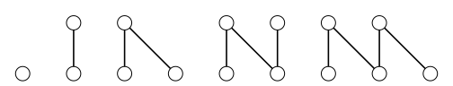
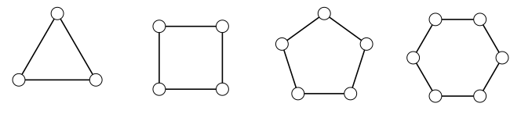

> [!def] [[Definition 12 (Paths And Cycles)]]: A path $P_n$ has vertices numbered $v_1,\ldots,v_n$ and edges $v_1v_2,\ldots,v_{n-1}v_n$. A cycle $C_n$ has vertices numbered $v_1,\ldots,v_n$ and edges $v_1v_2,\ldots,v_{n-1}v_n,v_nv_1$. An even cycle has even $n$; an odd cycle has odd $n$.
###### Examples.

i. Small paths.

ii. Small cycles.

###### Bibliography.

[1] Bickle. (n.d.). *Fundamentals of Graph Theory* (Chapter 1, p. 9). Supplied excerpt.

#mathematics #graph-theory #definition
