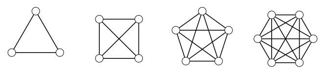

> [!def] [[Definition 13 (Complete And Empty Graphs)]]: A complete graph $K_n$ has order $n$ and every pair of vertices is adjacent. An empty graph $\bar{K}_n$ has order $n$ and no edges. The unique graph $K_1$ with one vertex is called the trivial graph.

Note that $m(K_n)=\binom n2=n(n-1)/2$. Complete and empty graphs have the largest and smallest possible sizes for order $n$.

###### Examples.

i. $K_3,K_4,K_5,K_6$.

###### Bibliography.

[1] Bickle. (n.d.). *Fundamentals of Graph Theory* (Chapter 1, pp. 9, 10). Supplied excerpt.

#mathematics #graph-theory #definition
