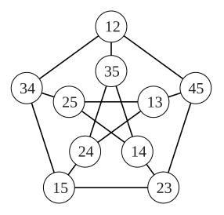
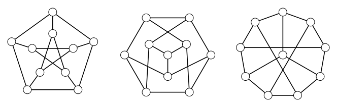

> [!def] [[Definition 18 (Petersen Graph)]]: The Petersen graph has vertices representing the $2$-element subsets of $[5]=\{1,2,3,4,5\}$. Edges join vertices whose subsets are disjoint.

Its order is $\binom52=10$. There are three elements of $[5]$ not contained in a given 2-element subset, so each vertex is adjacent to three others. Thus, Peterson graph is cubic, and hence has size $\frac{10\cdot3}{2}=15$. There cannot be three disjoint 2-element subsets of $[5]$, so the Petersen graph is triangle-free.

###### Examples.

i. The cycles $12,34,51,23,45$ and $13,52,41,35,24$ give a drawing with two $5$-cycles and matching edges between them. Other drawings of the same graph are shown below.

###### Bibliography.

[1] Bickle. (n.d.). *Fundamentals of Graph Theory* (Chapter 1, pp. 10, 11). Supplied excerpt.

#mathematics #graph-theory #definition
