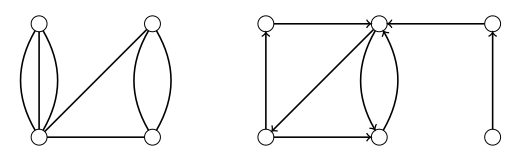

> [!def] [[Definition 2 (Multigraphs And Digraphs)]]: A multigraph $G$ consists of a finite nonempty set of vertices $V(G)$ and a multiset $E(G)$ of pairs of vertices. A directed graph (digraph) $D$ consists of a finite nonempty set of vertices $V(D)$ and a set $E(D)$ of ordered pairs of distinct vertices, called directed edges. A directed multigraph replaces the set $E(D)$ with a multiset.

###### Examples.

i. A multigraph and a digraph.

###### Bibliography.

[1] Bickle. (n.d.). *Fundamentals of Graph Theory* (Chapter 1, p. 2). Supplied excerpt.

#mathematics #graph-theory #definition
