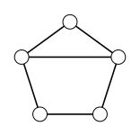

> [!def] [[Definition 20 (Vertex And Edge Operations)]]: $G-e$ or $G-X$ deletes edge $e$ or edge set $X$ from $E(G)$. $G-v$ or $G-S$ deletes vertex $v$ or vertex set $S$, together with all incident edges. $G+e$ adds $e$ to the edges of $G$.

For an unlabeled graph, an unspecified deletion or addition is defined only when every eligible choice gives the same graph.
These are the unary operations. A unary operation may produce a graph with a completely different vertex set.
###### Examples.

i. For every edge $e$ of $C_n$, $C_n-e=P_n$.

ii. Every missing edge of $C_5$ gives the same graph $C_5+e$.

###### Bibliography.

[1] Bickle. (n.d.). *Fundamentals of Graph Theory* (Chapter 1, p. 12). Supplied excerpt.

#mathematics #graph-theory #definition
