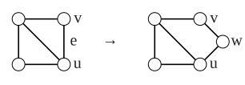

> [!def] [[Definition 21 (Subdivision)]]: A subdivision of an edge $e=uv$ deletes $e$ and adds a vertex $w$ and edges $uw,wv$. A graph $H$ is a subdivision of $G$ if it is obtained by some number (possibly zero) of edge subdivisions.

Loosely speaking, a subdivision can be thought of as inserting a vertex on an edge. Single edge subdivision increases both order and size by one.

###### Examples.

i. Subdividing the edge $e=uv$.

###### Bibliography.

[1] Bickle. (n.d.). *Fundamentals of Graph Theory* (Chapter 1, p. 12). Supplied excerpt.

#mathematics #graph-theory #definition
