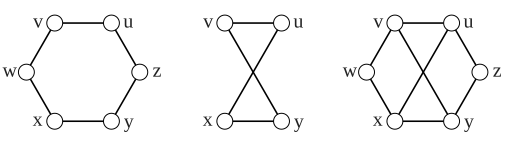

> [!def] [[Definition 23 (Union And Disjoint Union)]]: The union $G\cup H$ of graphs $G$ and $H$ is the graph with vertex set $V(G)\cup V(H)$ and edge set $E(G)\cup E(H)$. The union is a disjoint union if the vertex set of the graphs are disjoint. The disjoint union of $k$ copies of $G$ is denoted $kG$.

For unlabeled graphs, the union is taken to be disjoint.

A binary graph operation uses two graphs to produce new graph.
###### Examples.

i. A union with overlapping labeled vertex sets.

ii.  The $0$-regular graphs are exactly the empty graphs $nK_1$; every $1$-regular graph is $kK_2$.
###### Bibliography.

[1] Bickle. (n.d.). *Fundamentals of Graph Theory* (Chapter 1, p. 13). Supplied excerpt.

#mathematics #graph-theory #definition
