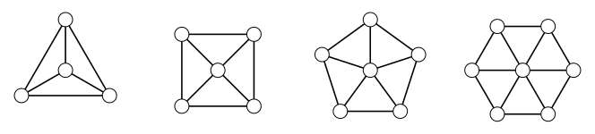

> [!def] [[Definition 24 (Join And Wheel)]]: The join $G+H$ is obtained from the disjoint union $G\cup H$ by adding all edges $\{uv:u\in V(G),\ v\in V(H)\}$. The wheel $W_n$, $n\ge4$, is the join of a cycle and a single vertex, $W_n=C_{n-1}+K_1$.

Union, join, and Cartesian product extend to more than two graphs; they are associative and commutative in the source’s unlabeled-graph convention.

###### Examples.

i. Wheels $W_4,W_5,W_6,W_7$.

###### Bibliography.

[1] Bickle. (n.d.). *Fundamentals of Graph Theory* (Chapter 1, pp. 13, 14). Supplied excerpt.

#mathematics #graph-theory #definition
