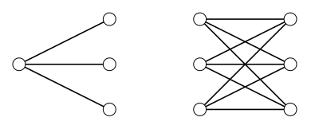

> [!def] [[Definition 25 (Complete Bipartite Graphs And Stars)]]: The complete bipartite graph $K_{r;s}$ is the join of two empty graphs: $K_{r;s}=\overline K_r+\overline K_s$. A star is $K_{1;s}$. The star $K_{1;3}$ is called a claw when it occurs as an induced subgraph.
###### Examples.

i. The star $K_{1;3}$ and the complete bipartite graph $K_{3;3}$.

###### Bibliography.

[1] Bickle. (n.d.). *Fundamentals of Graph Theory* (Chapter 1, p. 14). Supplied excerpt.

#mathematics #graph-theory #definition
