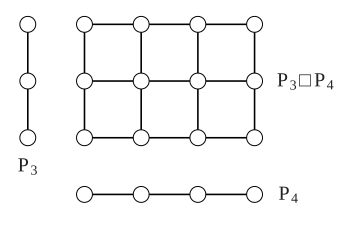

> [!def] [[Definition 26 (Cartesian Product)]]: The Cartesian product $G\square H$ of $G$ and $H$ has vertex set $V(G)\times V(H)$ and vertices $(u,v)$ adjacent to  $(u',v')$ if $u=u'$ and $vv' \in E(H)$, or $v=v'$ and $uu'\in E(G)$.

$G\square H$ has a copy of $G$ for each vertex of $H$, and vice versa; its edges decompose into these copies.

###### Examples.

i. $K_2\square K_2=C_4$.

ii. $P_3\square P_4$.

###### Bibliography.

[1] Bickle. (n.d.). *Fundamentals of Graph Theory* (Chapter 1, p. 14). Supplied excerpt.

#mathematics #graph-theory #definition
