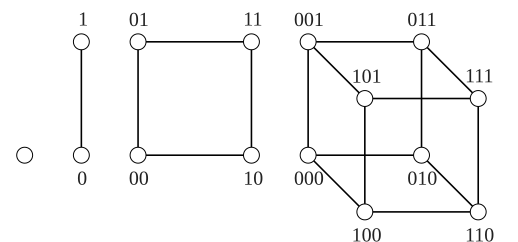

> [!def] [[Definition 28 (Hypercube)]]: The hypercube $Q_k$ is defined recursively by $Q_1=K_2$ and $Q_k=Q_{k-1}\square K_2$.

It is $k$-regular, with
$$n(Q_k)=2^k,\qquad m(Q_k)=k\,2^{k-1}.$$
###### Examples.

i. $Q_1=K_2$, $Q_2=C_4$, and $Q_3$. Equivalently, its vertices are the $k$-digit bitstrings; two are adjacent exactly when they differ in one digit.

###### Bibliography.

[1] Bickle. (n.d.). *Fundamentals of Graph Theory* (Chapter 1, pp. 14, 15). Supplied excerpt.

#mathematics #graph-theory #definition
