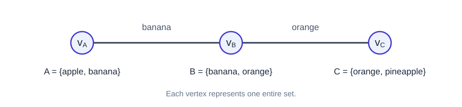

> [!def] [[Definition 3 (Intersection Graph)]]: Let $U$ be a set, and let $(S_i)_{i=1}^{n}$ be a finite, nonempty indexed family of subsets of $U$. The intersection graph of this family is the graph $G$ defined by
> $$V(G)=\{v_1,\ldots,v_n\},$$
> and
> $$E(G)=\bigl\{\{v_i,v_j\}:1\le i<j\le n,\;S_i\cap S_j\ne\varnothing\bigr\}.$$

Thus, $v_i$ represents the whole set $S_i$, and two distinct vertices are adjacent exactly when their represented sets intersect.
###### Examples.

i. Let
$$
A=\{\text{apple},\text{banana}\},\qquad
B=\{\text{banana},\text{orange}\},\qquad
C=\{\text{orange},\text{pineapple}\}.
$$
Since $A\cap B=\{\text{banana}\}$ and $B\cap C=\{\text{orange}\}$, the graph has edges $v_Av_B$ and $v_Bv_C$. Since $A\cap C=\varnothing$, there is no edge $v_Av_C$. Hence
$$
V(G)=\{v_A,v_B,v_C\},\qquad E(G)=\{\{v_A,v_B\},\{v_B,v_C\}\}.
$$

###### Bibliography.

[1] Bickle. (n.d.). *Fundamentals of Graph Theory* (Chapter 1, p. 4). Supplied excerpt.

[2] OpenAI. (2026, October 10). *Graph Theory study conversation* [ChatGPT conversation].

#mathematics #graph-theory #definition
