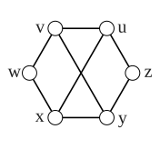

> [!def] [[Definition 32 (Distance Eccentricity And Center)]]: The distance $d(u,v)$ is the length of a shortest $u-v$ path. If $u,v$ lie in distinct components, we say $d(u,v)=\infty$. A $u-v$ geodesic is a $u-v$ path of length $d(u,v)$. The diameter $\operatorname{diam}(G)$ is the maximum length of a geodesic in $G$. The eccentricity $\operatorname{ecc}(v)$ is the maximum length of a geodesic starting at $v$. The radius $\operatorname{rad}(G)$ is the minimum eccentricity of its vertices. The center is the subgraph induced by the vertices of minimum eccentricity.

Observe that graphs with distance are a metric space.

For a connected graph,
$$e(v)=\max_{u\in V(G)}d(v,u),\quad \operatorname{rad}(G)=\min_{v\in V(G)}e(v),\quad \operatorname{diam}(G)=\max_{v\in V(G)}e(v).$$

For the last inequality, concatenate geodesics to obtain a walk and use [[Lemma 2 (Every Walk Contains A Path)]]. Thus distance gives a metric on the vertex set of a connected graph.

###### Examples.

i. In the graph below, $d(u,v)=1$, $\operatorname{rad}(G)=2$, $\operatorname{diam}(G)=3$, and the center is the $C_4$ induced by $u,v,y,x$.

ii. $\operatorname{diam}(Q_k)=k$, since changing all $k$ coordinates requires $k$ edges.

iii. For $W_{n+1}=C_n+K_1$ with {$n\ge4$}, the radius is $1$, the diameter is $2$, and the center is the vertex corresponding to $K_1$. The restriction in braces makes explicit the scope of this source example.

###### Bibliography.

[1] Bickle. (n.d.). *Fundamentals of Graph Theory* (Chapter 1, pp. 16, 17). Supplied excerpt.

#mathematics #graph-theory #definition
