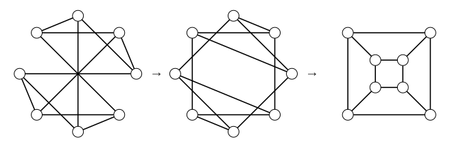
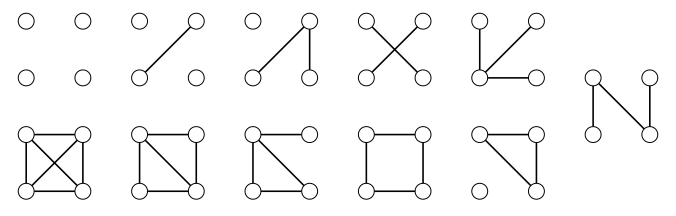

> [!def] [[Definition 6 (Drawing Of A Graph)]]: A drawing of a graph is a diagram with a small circle (open or solid) in the plane representing each vertex and a curve (often a straight line) joining two circles representing each edge.

Vertices must have distinct locations, and edges must not intersect vertices to which they are not incident. Edge crossings are allowed. A graph may have many drawings; different drawings may emphasize different properties. We say two such graphs are **isomorphic**.

###### Examples.

i. Three drawings of the same graph, ending with a drawing without edge crossings.

ii. The number of *labeled* graphs with vertex set $[n]$ is $2^{\binom n2}$, as there are $\binom n2$ pairs of vertices, each of which may be joined by an edge or not, and are two possibilities for each pair where each choice is independent. Moreover, since there are $n!$ vertex permutations, the number of *unlabeled* graphs are *at least* $\frac{2^{\binom n2}}{n!}$. This is not exact since the number of labeled graphs corresponding to each unlabeled graph varies. Using generating functions, it is possible to generate the sequence of the number of unlabeled graphs with $n$ vertices: 1, 2, 4, 11, 34, 156, 1044, 12346, $\dots$ This sequence is asymptotic to $\frac{2^{\binom n2}}{n!}$. To find all unlabeled graphs, we can just draw them. And to ensure that we had found all of them, we need some case-checking argument. For instance, for $n=4,$ the number of edges must be between $0$ and $6$. There is only one graph when the number of edges is $0, 1, 5,$
or $6$. For two edges, they can either be adjacent or not. For three edges, they either are all incident with the same vertex or, when two are adjacent, the third is adjacent to either both or only one of their other ends. And so on $\dots$ Note that there are $1, 1, 2, 3, 2, 1, 1$ unlabeled graphs corresponding to the number of edges $1, 2, \dots, 6$  respectively.

###### Bibliography.

[1] Bickle. (n.d.). *Fundamentals of Graph Theory* (Chapter 1, pp. 5, 6). Supplied excerpt.

#mathematics #graph-theory #definition
