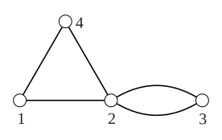

> [!thm] [[Theorem 2 (Counting Walks By Matrix Powers)]]: Let $G$ be a multigraph with vertices $v_1,\ldots,v_n$ and adjacency matrix $A(G)$. Then the $(i,j)$ entry of $A^k$ is the number of $v_i-v_j$ walks of length $k$ in $G$.

For a multigraph, the $(i,j)$ entry of $A$ records the number of edges between $v_i$ and $v_j$.

###### Examples.

i. For the multigraph below,

$$
A=\begin{bmatrix}
0&1&0&1\\1&0&2&1\\0&2&0&0\\1&1&0&0
\end{bmatrix},\qquad
A^3=\begin{bmatrix}
2&7&2&3\\7&2&12&7\\2&12&0&2\\3&7&2&2
\end{bmatrix}.
$$
Thus, for example, there are $12$ walks of length $3$ from vertex $2$ to vertex $3$.

> [!proof]
> We use induction on $k$. For $k = 1$, the result is immediate since a walk of length 1 contains a single edge. Assume for some $k$ that the $(i, j)$ entry of $A^k$, $a^{(k)}_{ij}$ , is the number of $v_i − v_j$ walks of length $k$ in $G$. Now $A^{k+1} = A^kA$, so $$a^{(k+1)}_{ij} = \sum_{t=1}^{n}a^{(k)}_{it} a_{tj}.$$ Now every $v_i − v_j$ walk of length $k + 1$ contains a $v_i − v_t$ walk of length $k$ and an edge from $v_t$ to $v_j$ . Thus the summation counts the number of $v_i − v_j$ walks of length $k + 1$. 

> [!cor] [[Corollary 4 (Counting Triangles By The Trace)]]: The number of triangles in a graph $G$ with adjacency matrix $A$ is $\frac16\operatorname{tr}(A^3)$.

> [!proof]
> A triangle is a closed walk of length 3. These walks are counted on the forward diagonal of $A^3$. Each triangle can be counted six ways, since there are three starting vertices and two directions. Thus $\frac{1}{6}tr(A^3)$ is the number of triangles in $G$.

###### Bibliography.

[1] Bickle. (n.d.). *Fundamentals of Graph Theory* (Chapter 1, pp. 15, 16). Supplied excerpt.

#mathematics #graph-theory #theorem #corollary #proof
