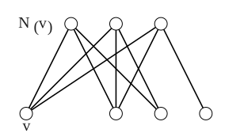

> [!thm] [[Theorem 4 (Mantel)]]: The maximum number of edges in a triangle-free graph of order $n$ is $\lfloor n^2/4\rfloor$, and the unique extremal graph is $K_{\lfloor n/2\rfloor;\lceil n/2\rceil}$.

**PROF DÜZELTİLTMEDİ**

Consequently, more than $\lfloor n^2/4\rfloor$ edges guarantee a triangle, and hence an odd cycle.

###### Proof.

> [!proof]
> Let $v$ have maximum degree $d$, as in [[Definition 9 (Degree And Neighborhood)]] and [[Definition 10 (Degree Sequence And Regularity)]]. Since $G$ is triangle-free by [[Definition 16 (H-Free And Triangle-Free Graphs)]], $N(v)$ is independent. Every edge therefore has an endpoint outside $N(v)$, so
> $$
> m(G)\le\sum_{u\notin N(v)}d(u)\le d(n-d)=m(K_{d;n-d})\le\left\lfloor\frac{n^2}{4}\right\rfloor.
> $$
> The product $d(n-d)$ is maximized when $d=\lfloor n/2\rfloor$ or $d=\lceil n/2\rceil$. The balanced [[Definition 25 (Complete Bipartite Graphs And Stars)]] attains this value. Equality requires $G$ to be bipartite, with the $n-d$ vertices outside $N(v)$ all of degree $d$ and the two partite sizes as close as possible. Hence $G=K_{\lfloor n/2\rfloor;\lceil n/2\rceil}$.

###### Bibliography.

[1] Bickle. (n.d.). *Fundamentals of Graph Theory* (Chapter 1, pp. 19, 20). Supplied excerpt.

#mathematics #graph-theory #theorem #proof
