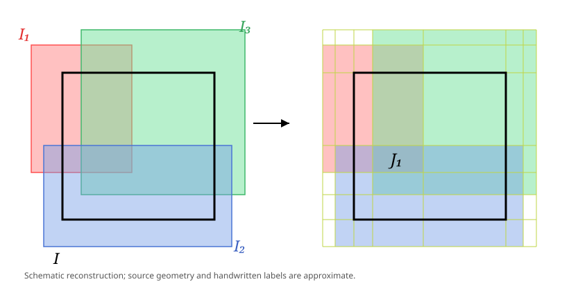

> [!lem] [[Lemma 1 (Volume Bound For A Finite Cell Cover)]]: If a cell $I\subseteq\mathbb R^n$ is covered by cells $I_1,\ldots,I_r$, then $\ell(I)\le\sum_{k=1}^r\ell(I_k)$.

^nt-e81fa13a6a7df7a6

###### Proof.

> [!proof]
> In each coordinate, the endpoints of $I,I_1,\ldots,I_r$ partition $\mathbb R$ into intervals. The finite intervals determine smaller cells $J_1,\ldots,J_s$ with disjoint interiors. There are sets $A_k$ with $\{1,\ldots,s\}=\bigcup_{k=1}^r A_k$ such that $I\subseteq\bigcup_{t=1}^sJ_t$ and $I_k=\bigcup_{t\in A_k}J_t$.
> By the volume formula in [[Definition 15 (Cells Intervals And Volume In Euclidean Space)]], $\ell(I_k)=\sum_{t\in A_k}\ell(J_t)$. For $A=\{t:J_t^\circ\cap I^\circ\ne\emptyset\}$, $\ell(I)=\sum_{t\in A}\ell(J_t)$. Therefore
> $$\sum_{k=1}^r\ell(I_k)=\sum_{k=1}^r\sum_{t\in A_k}\ell(J_t)\ge\sum_{t\in A}\ell(J_t)=\ell(I).$$
> 
> {Freehand marks and rectangle positions are reconstructed schematically.}

###### Bibliography.

[1] Benli, G. (2026, October 6). *MATH 419 measure theory lecture notes* (Version 11:23, p. 17). METU. [PDF](_support/attachments/f5a9662d-M1-2d6fc175de0e.pdf).

#mathematics #measure-theory #lemma
