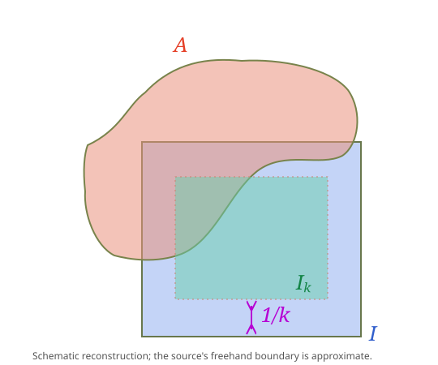

> [!prop] [[Proposition 11 (Cells Are Lebesgue Measurable)]]: If $I\subseteq\mathbb R^n$ is a cell, then $I$ is measurable and hence $m(I)=\ell(I)$.

^nt-09ee238bce3d2908

###### Proof.

> [!proof]
> By [[Lemma 2 (Finite-Outer-Measure Test For Measurability)]], take $A\subseteq\mathbb R^n$ with $m^*(A)<\infty$; it suffices to show $m^*(A)\ge m^*(A\cap I)+m^*(A\cap I^c)$.
> Let $I_k=\{x\in I:\operatorname{dist}(x,I^c)>1/k\}$. The source covers $I-I_k$ by $2n$ cells, each having one side of length $1/k$, and bounds its outer measure by $2nA^n/k$, where $A$ is the maximum side length of $I$. Therefore $m^*(I-I_k)\to0$. The letter $A$ is reused by the source here for a side-length bound.
> 
> {The freehand boundary of the test set is reconstructed schematically.}
> By [[Proposition 6 (Monotonicity And Subadditivity Of Outer Measure)]],
> $$m^*(A\cap I_k)\le m^*(A\cap I)\le m^*(A\cap I_k)+m^*(I-I_k),$$
> so $m^*(A\cap I)=\lim_km^*(A\cap I_k)$. Since $\operatorname{dist}(A\cap I_k,A\cap I^c)\ge1/k$ and their union is contained in $A$, [[Proposition 7 (Outer Measure Of Positively Separated Sets)]] gives
> $$m^*(A)\ge m^*((A\cap I_k)\cup(A\cap I^c))=m^*(A\cap I_k)+m^*(A\cap I^c).$$
> Take $k\to\infty$. The measure identity follows from [[Proposition 8 (Outer Measure Equals Cell Volume)]] and [[Definition 19 (Lebesgue Sigma-Algebra And Lebesgue Measure)]].

###### Bibliography.

[1] Benli, G. (2026, October 6). *MATH 419 measure theory lecture notes* (Version 11:23, pp. 22, 23). METU. [PDF](_support/attachments/f5a9662d-M1-2d6fc175de0e.pdf).

#mathematics #measure-theory #proposition
