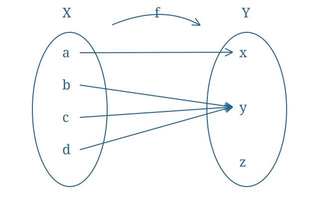

# Exercise 11 (An Open Map Which Is Neither Closed Nor Continuous)

Let $X=\{a,b,c,d\}$ and $Y=\{x,y,z\}$ be sets. Let
$$\mathcal T=\{\emptyset,\{a\},\{b\},\{d\},\{a,b\},\{a,d\},\{b,d\},\{a,b,d\},X\}$$
and
$$\mathcal V=\{\emptyset,\{x\},\{y\},\{x,y\},Y\}$$
be topologies on $X$ and $Y$, respectively. Consider $f:X\to Y$ given by the diagram:

Thus $f(a)=x$ and $f(b)=f(c)=f(d)=y$.

i. Is $f$ an open function?

ii. Is $f$ a closed function?

iii. Is $f$ a continuous function?

^nt-5f5e0dbe0a0d714b

###### Proof.

> [!proof]
> i. For [[Definition 6 (Open And Closed Functions)]], the images of all the open subsets are:
> i. $f(\emptyset)=\emptyset\in\mathcal V$.
> ii. $f(\{a\})=\{x\}\in\mathcal V$.
> iii. $f(\{b\})=\{y\}\in\mathcal V$.
> iv. $f(\{d\})=\{y\}\in\mathcal V$.
> v. $f(\{a,b\})=\{x,y\}\in\mathcal V$.
> vi. $f(\{a,d\})=\{x,y\}\in\mathcal V$.
> vii. $f(\{b,d\})=\{y\}\in\mathcal V$.
> viii. $f(\{a,b,d\})=\{x,y\}\in\mathcal V$.
> ix. $f(X)=\{x,y\}\in\mathcal V$.
> Therefore $f$ is an open function.
>
> ii. By [[Definition 2 (Closed Sets)]],
> $$\mathcal T_K=\{X,\{b,c,d\},\{a,c,d\},\{a,b,c\},\{c,d\},\{b,c\},\{a,c\},\{c\},\emptyset\},$$
> $$\mathcal V_K=\{Y,\{y,z\},\{x,z\},\{z\},\emptyset\}.$$
> The images recorded in the lecture are:
> i. $f(X)=\{x,y\}\notin\mathcal V_K$.
> ii. $f(\{b,c,d\})=\{y\}$.
> iii. $f(\{a,c,d\})=\{x,y\}$.
> iv. $f(\{a,b,c\})=\{x,y\}$.
> v. $f(\{c,d\})=\{y\}$.
> vi. $f(\{b,c\})=\{y\}$.
> vii. $f(\{a,c\})=\{x,y\}$.
> viii. $f(\{c\})=\{y\}$.
> ix. $f(\emptyset)=\emptyset$.
> Since $X\in\mathcal T_K$, but $f(X)\notin\mathcal V_K$, $f$ is not a closed function.
>
> iii. $\{y\}\in\mathcal V$, but $f^{-1}(\{y\})=\{b,c,d\}\notin\mathcal T$. Hence $f$ is discontinuous, by [[Definition 5 (Continuous Functions)]].

###### Bibliography.

[1] *420-Week 1-Lecture 3 (1)*. (n.d.). [Lecture material] (pp. 9, 10, 11). [420-Week 1-Lecture 3 (1).pdf](../_materials/_sources/420-Week%201-Lecture%203%20(1).pdf)
[2] *420-Week 1-Lecture 3*. (n.d.). [Lecture material] (pp. 9, 10, 11). [420-Week 1-Lecture 3.pdf](../_materials/_sources/420-Week%201-Lecture%203.pdf)
[3] *420-Week 2-Lecture 1*. (n.d.). [Lecture material] (p. 1). [420-Week 2-Lecture 1.pdf](../_materials/_sources/420-Week%202-Lecture%201.pdf)

#mathematics #point-set-topology #exercise
