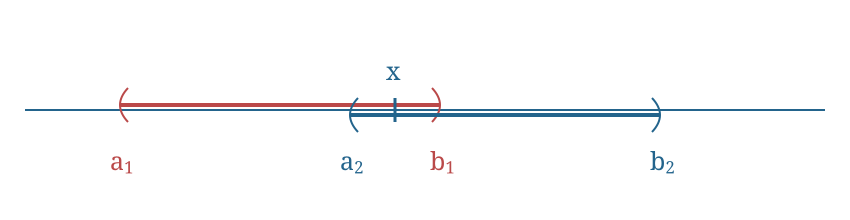

# Exercise 18 (Open Intervals Form A Basis On The Real Line)

Let $X=\mathbb R$ and $\mathcal B=\{(a,b)\mid a,b\in\mathbb R,\ a<b\}$. Show that $\mathcal B$ forms a base for some topology on $\mathbb R$, the [[Definition 13 (Usual Topology On The Real Line)]].

^nt-1d2e31a4cb4abb32

###### Proof.

> [!proof]
> We check the two properties of [[Theorem 4 (Conditions For A Class To Be A Basis)]].
> i. For every $x\in\mathbb R$, $x\in(x-1,x+1)$. Therefore
> $$\mathbb R\subseteq\bigcup_{x\in\mathbb R}(x-1,x+1)\subseteq\bigcup\mathcal B\subseteq\mathbb R.$$
> Hence $\mathbb R=\bigcup\mathcal B$.
> ii. Let $B_1=(a_1,b_1)$ and $B_2=(a_2,b_2)$ belong to $\mathcal B$, and let $x\in B_1\cap B_2$.

> [!proof]
> Set $a_3=\max\{a_1,a_2\}$ and $b_3=\min\{b_1,$ {$b_2$} $\}$. Then $x\in(a_3,b_3)\subseteq B_1\cap B_2$, with $(a_3,b_3)\in\mathcal B$. Therefore $\mathcal B$ is a base for $\mathcal T$.

The source writes $b_3=\min\{b_1,b_3\}$; the braced $b_2$ above is inferred from the two intervals and their diagram.

###### Bibliography.

[1] *420-Week 2-Lecture 3*. (n.d.). [Lecture material] (pp. 6, 7, 8). [420-Week 2-Lecture 3.pdf](../_materials/_sources/420-Week%202-Lecture%203.pdf)

#mathematics #point-set-topology #exercise
