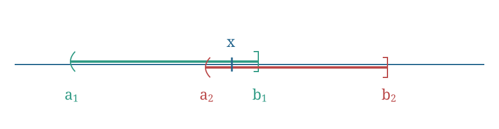

# Exercise 20 (Right-Closed Intervals Form A Basis)

Let $X=\mathbb R$ and $\mathcal B=\{(a,b]\mid a,b\in\mathbb R,\ a<b\}$. Show that $\mathcal B$ is a base for some topology $\mathcal T$ on $\mathbb R$, the [[Definition 14 (Upper Limit Topology)]].

^nt-a790083a7995c44c

###### Proof.

> [!proof]
> We shall show that $\mathcal B$ satisfies the two properties in [[Theorem 4 (Conditions For A Class To Be A Basis)]].
> i. Let $x\in\mathbb R$. Then $x\in(x-1,x]$. Thus
> $$\mathbb R\subseteq\bigcup_{x\in\mathbb R}(x-1,x]=\bigcup\mathcal B'\subseteq\bigcup\mathcal B\subseteq\mathbb R,$$
> where $\mathcal B'=\{(x-1,x]\mid x\in\mathbb R\}$. Therefore $\bigcup\mathcal B=\mathbb R$.
> ii. Let $B_1=(a_1,b_1]$ and $B_2=(a_2,b_2]$ belong to $\mathcal B$, and let $x\in B_1\cap B_2$.

> [!proof]
> Set $a_3=\max\{a_1,a_2\}$ and $b_3=\min\{b_1,b_2\}$. Let $B_3=(a_3,b_3]$. Then $x\in B_3\subseteq B_1\cap B_2$. Therefore $\mathcal B$ is a base for some topology $\mathcal T$ on $\mathbb R$.

In the line specifying $x\in B_1\cap B_2$, the source writes $(a_1,b_1]\cap(a_2,b_1]$ after defining $B_2=(a_2,b_2]$. The two definitions and their diagram supply the displayed intersection above.

###### Bibliography.

[1] *420-Week 2-Lecture 3*. (n.d.). [Lecture material] (pp. 10, 11). [420-Week 2-Lecture 3.pdf](../_materials/_sources/420-Week%202-Lecture%203.pdf)

#mathematics #point-set-topology #exercise
