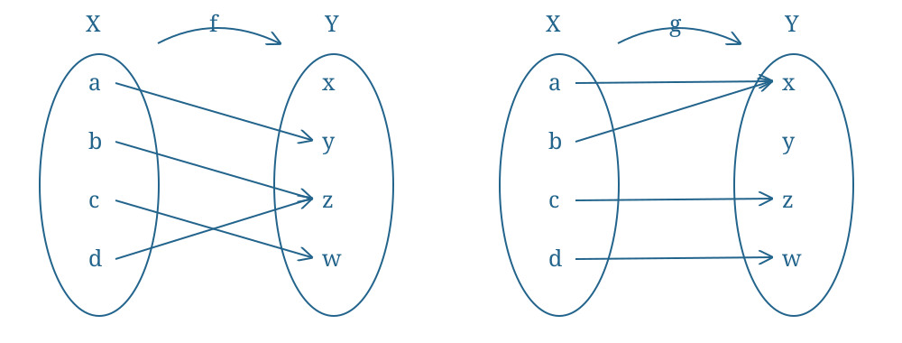

# Exercise 7 (Continuity Of Two Maps Between Finite Spaces)

Consider the following topologies on $X=\{a,b,c,d\}$ and $Y=\{x,y,z,w\}$, respectively:
$$\mathcal T=\{\emptyset,\{a\},\{a,b\},\{a,b,c\},X\},$$
$$\mathcal V=\{\emptyset,\{x\},\{y\},\{x,y\},\{y,z,w\},Y\}.$$
Moreover, consider the functions $f:X\to Y$ and $g:X\to Y$ defined by the diagrams:

The mappings shown are
$$f(a)=y,\quad f(b)=z,\quad f(c)=w,\quad f(d)=z,$$
$$g(a)=x,\quad g(b)=x,\quad g(c)=z,\quad g(d)=w.$$
Determine whether $f$ and $g$ are $\mathcal T$-$\mathcal V$ continuous.

^nt-3e02786efc5a6765

###### Proof.

> [!proof]
> We apply [[Definition 5 (Continuous Functions)]]:
> i. $f^{-1}(\emptyset)=\emptyset\in\mathcal T$.
> ii. $f^{-1}(\{x\})=\emptyset\in\mathcal T$.
> iii. $f^{-1}(\{y\})=\{a\}\in\mathcal T$.
> iv. $f^{-1}(\{x,y\})=\{a\}\in\mathcal T$.
> v. $f^{-1}(\{y,z,w\})=X\in\mathcal T$.
> vi. $f^{-1}(Y)=X\in\mathcal T$.
>
> Therefore $f$ is $\mathcal T$-$\mathcal V$ continuous.
>
> Because $\{y,z,w\}\in\mathcal V$, but $g^{-1}(\{y,z,w\})=\{c,d\}\notin\mathcal T$, $g$ is not $\mathcal T$-$\mathcal V$ continuous.

###### Bibliography.

[1] *420-Week 1-Lecture 3 (1)*. (n.d.). [Lecture material] (pp. 3, 4). [420-Week 1-Lecture 3 (1).pdf](../_materials/_sources/420-Week%201-Lecture%203%20(1).pdf)
[2] *420-Week 1-Lecture 3*. (n.d.). [Lecture material] (pp. 3, 4). [420-Week 1-Lecture 3.pdf](../_materials/_sources/420-Week%201-Lecture%203.pdf)

#mathematics #point-set-topology #exercise
