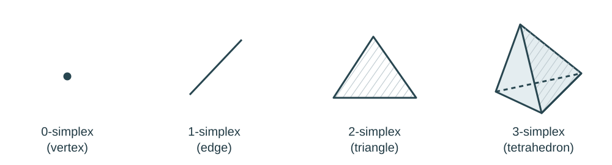

> [!def] [[Definition 6 (K-Simplex)]]: Let $v_0,\ldots,v_k$ be geometrically independent points in $\mathbb{R}^n$, meaning that the vectors $v_1-v_0,\ldots,v_k-v_0$ are linearly independent. The $k$-simplex $\sigma$ spanned by these points is the set of all convex combinations:
> $$
> \sigma=\left\{\sum_{i=0}^{k}t_i v_i\;\middle|\;\sum_{i=0}^{k}t_i=1\text{ and }t_i\geq 0\text{ for all }i\right\}.
> $$

Note that each sum $\sum_{i=0}^{k}t_iv_i$ is a point $x$. For each fixed $x \in \sigma$, the coefficients $(t_0, \dots, t_k)$ are unique and called the barycentric coordinates. If we restrict one or more of these coefficients to be zero, the resulting subset is spanned by a subset of the original vertices. Such a subset is called a *face* of $\sigma$. A face spanned by all but one vertex is called a *facet*, and has dimension $k-1$. 

###### Examples.

###### Bibliography.

[1] Pamuk M. (2026F). *Lecture*. 

#mathematics #simplices #definition
