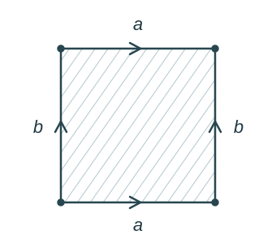
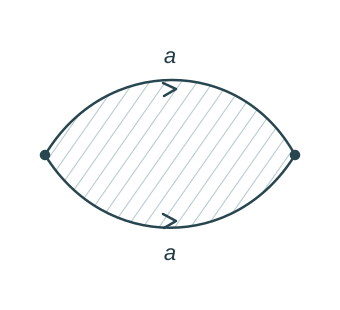
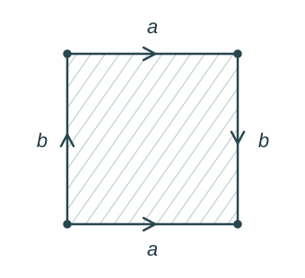

# Polygonal Presentations Of Surfaces

We can construct compact surfaces by taking a polygon in the plane and identifying its edges in pairs. We represent this gluing using boundary words.

###### Examples.

i. Torus: $S^1\times S^1=T^2$.

After gluing, there is one vertex because all four corners coincide; there are two edges.

ii. Sphere: $S^2$.

iii. Klein bottle. -no boundary

###### Bibliography.

[1] *Polygonal Gluing Examples*. (n.d.). [Handwritten lecture continuation, [source image](_support/attachments/23eac36d-M12-a5ee8cbdd60f.png)].

[2] *Surfaces And Their Triangulations*. (n.d.). [Handwritten lecture page 423-3, [source image](_support/attachments/23eac36d-M11-9fc3243c93cf.png)].

#mathematics #surfaces
